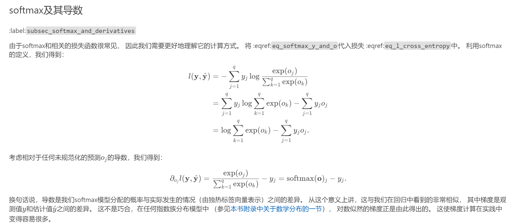

## part 1
###### a

因为其余的单词真实概率是0，所以说做乘法只有真正的单词的log被保留下来

###### b

😫不会计算，只能抄一抄这个书上的了。不过要注意到这里也同时回答了第三问，由此可见相关知识还是很重要的
简而言之，就是让这个词向量不断去贴近实际的分布情况

###### c

L2正则化在短语二分类下游任务中的影响

在许多使用词嵌入的下游应用中，L2正则化被用于词嵌入向量（例如 $u/||u||_2$，其中 $||u||_2=\sum u_i^2$），而不是原始形式（例如 $u$）。让我们考虑一个假设的下游任务：短语的二分类，判断其为正面还是负面。该任务中，根据单词的个别嵌入的总和来决定符号。

**L2正则化何时会带走下游任务的有用信息？**

L2正则化会对所有词嵌入向量施加惩罚，使其更加接近原点。这可能会导致以下情况：

* **语义相似的词嵌入向量被拉近。** 例如，如果“国王”和“女王”的词嵌入向量语义相似，那么L2正则化可能会使它们更加接近，从而降低它们之间的区分度。这可能会对下游任务产生负面影响，例如情感分析或句义相似度计算，因为这些任务依赖于词嵌入向量能够准确地反映词语之间的细微差别。
* **重要特征被缩小。** 如果某些词嵌入向量对于下游任务很重要，例如情感分析中的情感指示词，那么L2正则化可能会缩小这些向量的幅度，从而降低它们的影响力。这也会对任务性能产生负面影响。

**L2正则化何时不会带走下游任务的有用信息？**

在以下情况下，L2正则化不太可能对下游任务产生负面影响：

* **词嵌入向量已经很好地分离。** 如果词嵌入向量已经很好地分离，例如经过精心训练或使用其他正则化方法（例如L1正则化），那么L2正则化的影响就较小。
* **下游任务对词嵌入向量的幅度不敏感。** 如果下游任务只关注词嵌入向量之间的方向，而对它们的幅度不敏感，那么L2正则化的影响就较小。例如，如果下游任务是计算两个词向量的余弦相似度，那么L2正则化不会改变相似度分数的相对大小。

**提示分析：**

考虑 $u_x=\alpha u_y$ 对于某些词 $x\neq y$ 和某个标量 $\alpha$。当 $\alpha$ 为正时，正则化后的 $u_x$ 和 $u_y$ 的值是多少？

根据L2正则化公式，正则化后的词嵌入向量为：

$$u_x' = \frac{u_x}{||u_x||_2}$$

$$u_y' = \frac{u_y}{||u_y||_2}$$

因此，正则化后的 $u_x$ 和 $u_y$ 的值将与原始值成正比：

$$u_x' = \frac{\alpha u_y}{||u_y||_2} = \alpha \frac{u_y}{||u_y||_2} = \alpha u_y'$$

$$u_y' = u_y'$$

此类正则化可能会如何影响或不影响结果分类？

由于正则化后的 $u_x$ 和 $u_y$ 的值与原始值成正比，因此它们之间的方向保持不变。这意味着对于基于方向的分类任务，例如情感分析或句义相似度计算，L2正则化不会影响结果。

但是，正则化后的词嵌入向量可能会缩小幅度。这可能会对基于幅度的分类任务产生负面影响，例如短语二分类。例如，如果 $u_x$ 和 $u_y$ 代表两个短语的词嵌入向量，那么L2正则化可能会缩小它们的幅度，从而使它们之间的差异更小。这可能会导致分类器更加难以区分正面和负面短语。

总而言之，L2正则化在短语二分类下游任务中的影响取决于词嵌入向量的质量、下游任务对词嵌入向量幅度的敏感度以及正则化强度。在某些情况下，L2正则化可能会带走下游任务的有用信息，但在其他情况下，它可能会帮助提高性能。

## part 3

###### a-手动解析语法树
(待留图)

###### b-执行步数

应该是2*n-1

首先n个单词肯定要全部压栈，然后n个单词需要n-1次出栈操作