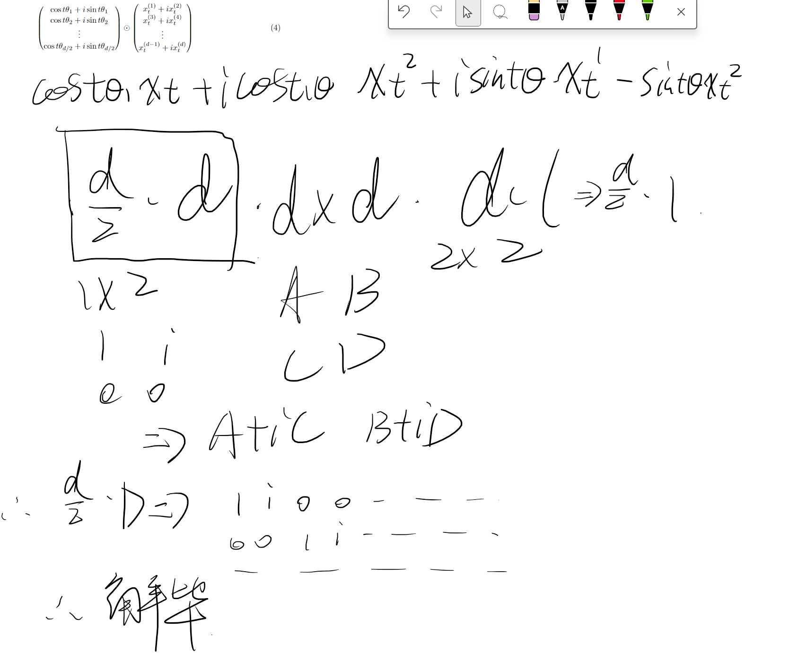

## Part 1

### a

当 \( q \) 和 \( v \) 相等时，只有相等的 \( q \) 和 \( v \) 才会是1，其余情况注意力分数是0。

### b

当 \( q = K_a + K_b \) 时（直接数值相加也可以，这里的 \( K \) 为了满足题意，应该是类似于独热编码的形式），此时经过注意力分数计算，两者都获得相同的注意力分数，其余情况注意力分数为0。经过Softmax修正以后，两者均为0.5，所以说得到融合表达。

### c

#### i

选择 \( q = \mu_a + \mu_b \)。解释原因见图，是ChatGPT的答案（数学不好是这样的）。

图中解释可以认为是 \( q \) 在多维度上的扩展，所以说结合正交和 \( a \)、\( b \) 的答案，自然可以得出正确的 \( q \)。

#### ii

## Part 2

### a

#### i

原来 \( Q \)、\( K \)、\( V \) 有：

\[ Q = XW_Q, K = XW_K, V = XW_V \]

置换后得到新的 \( Q \)、\( K \)、\( V \) 如下：

\[ Q_1 = X_pW_Q, K_1 = X_pW_K, V_1 = X_pW_V \]

原先 \( H \) 的计算公式如下：

\[ H = \text{softmax}\left(\frac{Q_1 K_1^\top}{\sqrt{d}}\right) V_1 \]

带入新的 \( Q \)、\( K \)、\( V \) 得到：

\[ H_1 = \text{softmax}\left(\frac{X_p Q K^\top X_p^\top}{\sqrt{d}}\right) X_p V \]

因为 \(\text{softmax}(PAP^\top) = P \text{softmax}(A) P^\top \) 恒成立，所以得出：

\[ H_1 = X_p \text{softmax}\left(\frac{Q K^\top}{\sqrt{d}}\right) X_p^\top X_p V \]

因为置换矩阵也是正交矩阵，满足：

\[ X_p X = I \]

因此化简上面 \( H \) 得到：

\[ H_1 = X_p \text{softmax}\left(\frac{Q K^\top}{\sqrt{d}}\right) V \]

置换前 \( Z \) 的计算公式如下：

\[ Z = \text{ReLU}(H W_1 + \mathbf{1} \cdot b_1) W_2 + \mathbf{1} \cdot b_2 \]

带入置换后 \( H \) 公式更新如下：

\[ Z_1 = \text{ReLU}(X_p H W_1 + \mathbf{1} \cdot b_1) W_2 + \mathbf{1} \cdot b_2 \]

因为 \(\mathbf{1} = I\) 

所以代换后利用如下公式 \(\text{ReLU}(PA) = P \text{ReLU}(A)\) 替换加上化简得到：

\[ Z_1 = X_p \text{ReLU}(H W_1 + X_p^\top \mathbf{1} \cdot b_1) W_2 + X_p X_p^\top \mathbf{1} \cdot b_2 \]

因为：\[ X_p^\top \mathbf{1} = \mathbf{1} \]

继续化简得到：

\[ Z_1 = X_p (\text{ReLU}(H W_1 + \mathbf{1} \cdot b_1) W_2 + \mathbf{1} \cdot b_2) \]

即：\[ Z_1 = X_p Z \]

#### ii

这个证明了交换顺序不影响最后注意力计算的结果，所以说计算结果是和位置无关的，这导致在注意力层中句子的位置信息被忽略了，会导致很严重的后果。

### b

#### i

能够解决。这样子的话即使一句话里面都出现了某个单词，但是因为位置的不同，他们的嵌入表示并不完全相同，这个微小的差异能够被学习到，模型有可能就会学会这个差异表示不同的位置。

#### ii

借用一下李沐老师课程里面的图片，在同一列里面，如果句子长度够长是可以出现重复编码的，如果不同列，也就是同一行，在部分地方也是有交点的。所以我个人认为是存在相同编码的情况的。

## Part 3

### g

#### i

简而言之，通过对 \( D \times D \) 的矩阵运用一个 \( D/2 \times D \) 的变换矩阵就可以让上面的结果和下面的一样。

#### ii

使用旋转解释，RoPE 操作可以视为将复数 \( x_t^{(1)} + ix_t^{(2)} \) 按角度 \( t\theta \) 旋转。

假设二维特征向量 \( z_1 = a_1 + ib_1 \) 和 \( z_2 = a_2 + ib_2 \)，它们的 RoPE 嵌入分别为 \(\text{RoPE}(z_1, t_1)\) 和 \(\text{RoPE}(z_2, t_2)\)。

RoPE 嵌入在位置 \( t \) 的复数形式可以表示为：

\[ \text{RoPE}(z, t) = z e^{it\theta} \]

因此，

\[ \text{RoPE}(z_1, t_1) = z_1 e^{it_1\theta} \]
\[ \text{RoPE}(z_2, t_2) = z_2 e^{it_2\theta} \]

我们需要证明：

\[ \langle \text{RoPE}(z_1, t_1), \text{RoPE}(z_2, t_2) \rangle = \langle \text{RoPE}(z_1, t_1 - t_2), \text{RoPE}(z_2, 0) \rangle \]

首先计算左边：

\[ \langle \text{RoPE}(z_1, t_1), \text{RoPE}(z_2, t_2) \rangle = \langle z_1 e^{it_1\theta}, z_2 e^{it_2\theta} \rangle \]

向量点积由复数的实部表示，即：

\[ \langle z_1 e^{it_1\theta}, z_2 e^{it_2\theta} \rangle = \text{Re}( (z_1 e^{it_1\theta}) (z_2 e^{it_2\theta})^* ) \]

其中 \((z_2 e^{it_2\theta})^* = z_2^* e^{-it_2\theta}\)，所以：

\[ (z_1 e^{it_1\theta}) (z_2 e^{it_2\theta})^* = z_1 z_2^* e^{it_1\theta} e^{-it_2\theta} = z_1 z_2^* e^{i(t_1 - t_2)\theta} \]

因此：

\[ \langle z_1 e^{it_1\theta}, z_2 e^{it_2\theta} \rangle = \text{Re}( z_1 z_2^* e^{i(t_1 - t_2)\theta} ) \]

再计算右边：

\[ \langle \text{RoPE}(z_1, t_1 - t_2), \text{RoPE}(z_2, 0) \rangle = \langle z_1 e^{i(t_1 - t_2)\theta}, z_2 \rangle \]

\[ = \text{Re}( (z_1 e^{i(t_1 - t_2)\theta}) z_2^* ) \]

\[ = \text{Re}( z_1 z_2^* e^{i(t_1 - t_2)\theta} ) \]

因此，我们证明了：

\[ \langle \text{RoPE}(z_1, t_1), \text{RoPE}(z_2, t_2) \rangle = \langle \text{RoPE}(z_1, t_1 - t_2), \text{RoPE}(z_2, 0) \rangle \]

这表明 RoPE 嵌入的两个向量在位置 \( t_1 \) 和 \( t_2 \) 的点积仅取决于相对位置 \( t_1 - t_2 \)。

注：这里是 GPT 写的证明，本人试图用笨方法证明，但是忘了点积应该是 \( A B^\top \) 的结果了，导致算出来的左边化简后全是 \( t_1 + t_2 \)，右边是 \( t_1 - t_2 \)，唉唉。

最后注：排版让gpt帮忙优化了一下，比初版好一点